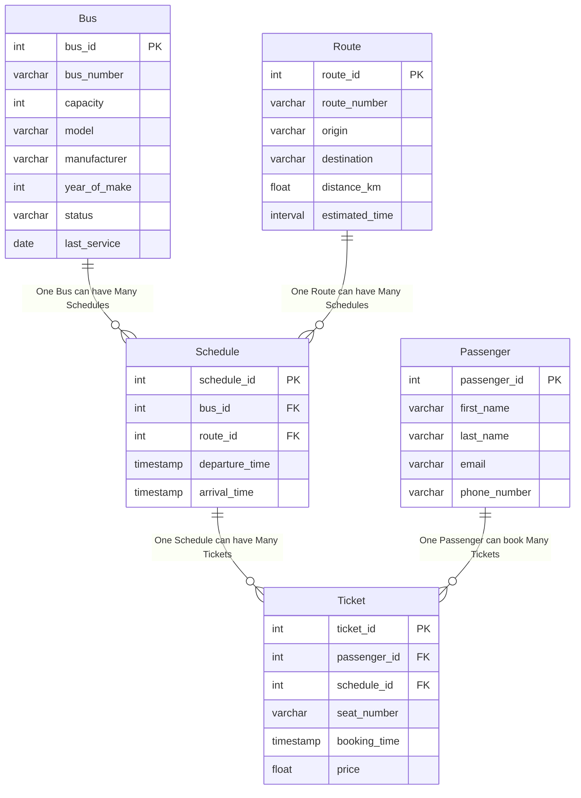

# Fleet Management System SQL Project

<a name="readme-top"></a>

<!-- TABLE OF CONTENTS -->

# 📗 Table of Contents

- [My SQL Project](#about-project)
- [📗 Table of Contents](#-table-of-contents)
- [📖 My SQL Project](#about-project)
  - [🛠 Built With ](#-built-with-)
    - [Tech Stack ](#tech-stack-)
    - [Key Features ](#key-features-)
  - [💻 Getting Started ](#-getting-started-)
    - [Prerequisites](#prerequisites)
    - [Setup](#setup)
    - [Usage](#usage)
  - [👥 Authors ](#-authors-)
  - [🔭 Future Features ](#-future-features-)
  - [🤝 Contributing ](#-contributing-)

<!-- PROJECT DESCRIPTION -->

# 📖 My SQL Project <a name="about-project"></a>

**My SQL Project** is a simple Database that uses SQL, Postgres via Supabase to create, query and secure a **Fleet Management System** database.

## 🛠 Built With <a name="built-with"></a>

### Tech Stack <a name="tech-stack"></a>
- SQL
- Postgres DB

<!-- Features -->

### Key Features <a name="key-features"></a>

- [ ] **Tables**
- [ ] **Schema**
- [ ] **Access control**

<p align="right">(<a href="#readme-top">back to top</a>)</p>

<!-- GETTING STARTED -->

## 💻 Getting Started <a name="getting-started"></a>

To rebuild this DB, follow these steps.

### Prerequisites

To run this project, you need:
- [A Supabase account](https://supabase.com/)
- [Knowledge on SQL](https://www.w3schools.com/sql/)
- A schema for creating your tables in the DB

<!-- ### Setup -->
### Setup

Copy the contents of this Readme.md to your Project's file

OR

Clone this repository to your desired folder:

```sh
  git clone https://github.com/joeyshiru/Data-Tools-Project
  cd Final-Project-1
```

<!-- ### DB Creation -->

### DB Schema

- The DB is made up of 5 tables. Each table has 5 entries.
- To create the table, you will need a schema as shown below:

```sql

-- Initialize your schema
create schema FMS;

-- Create Bus table
create table FMS.Bus (
    bus_id serial primary key,
    bus_number varchar(10) unique not null,
    capacity int not null,
    model varchar(50) not null,
    manufacturer varchar(50) not null,
    year_of_make int not null,
    status varchar(20) not null,
    last_service date not null
);

-- Create Route table
create table FMS.Route (
    route_id serial primary key,
    route_number varchar(10) unique not null,
    origin varchar(100) not null,
    destination varchar(100) not null,
    distance_km float not null,
    estimated_time interval not null
);

-- Create Schedule table
create table FMS.Schedule (
    schedule_id serial primary key,
    bus_id int not null references FMS.Bus(bus_id),
    route_id int not null references FMS.Route(route_id),
    departure_time timestamp not null,
    arrival_time timestamp not null
);

-- Create Passenger table
create table FMS.Passenger (
    passenger_id serial primary key,
    first_name varchar(50) not null,
    last_name varchar(50) not null,
    email varchar(100) unique not null,
    phone_number varchar(15) unique not null
);

-- Create Ticket table
create table FMS.Ticket (
    ticket_id serial primary key,
    passenger_id int not null references FMS.Passenger(passenger_id),
    schedule_id int not null references FMS.Schedule(schedule_id),
    seat_number varchar(10) not null,
    booking_time timestamp not null,
    price float not null
);


-- Sample data for FMS.Bus
insert into FMS.Bus (bus_number, capacity, model, manufacturer, year_of_make, status, last_service) values
('KDA 123A', 45, 'Coaster', 'Toyota', 2018, 'Active', '2025-07-01'),
('KCB 456B', 33, 'Rosa', 'Mitsubishi', 2017, 'Active', '2025-06-15'),
('KCE 789C', 51, 'Isuzu NQR', 'Isuzu', 2019, 'Maintenance', '2025-05-20'),
('KDH 321D', 60, 'Marcopolo', 'Scania', 2020, 'Active', '2025-07-10'),
('KCF 654E', 40, 'Optare', 'Ashok Leyland', 2016, 'Inactive', '2025-04-30');

-- Sample data for FMS.Route
insert into FMS.Route (route_number, origin, destination, distance_km, estimated_time) values
('R001', 'Nairobi', 'Mombasa', 485.0, '08:00:00'),
('R002', 'Kisumu', 'Nairobi', 350.0, '06:00:00'),
('R003', 'Nakuru', 'Eldoret', 160.0, '03:00:00'),
('R004', 'Nairobi', 'Thika', 45.0, '01:00:00'),
('R005', 'Mombasa', 'Malindi', 120.0, '02:30:00');

-- Sample data for FMS.Schedule
insert into FMS.Schedule (bus_id, route_id, departure_time, arrival_time) values
(1, 1, '2025-10-14 07:00:00', '2025-10-14 15:00:00'),
(2, 2, '2025-10-14 08:00:00', '2025-10-14 14:00:00'),
(3, 3, '2025-10-14 09:00:00', '2025-10-14 12:00:00'),
(4, 4, '2025-10-14 06:30:00', '2025-10-14 07:30:00'),
(5, 5, '2025-10-14 10:00:00', '2025-10-14 12:30:00');

-- Sample data for FMS.Passenger
insert into FMS.Passenger (first_name, last_name, email, phone_number) values
('Wanjiku', 'Mwangi', 'wanjiku.mwangi@example.com', '0712345678'),
('Otieno', 'Omondi', 'otieno.omondi@example.com', '0723456789'),
('Amina', 'Abdalla', 'amina.abdalla@example.com', '0734567890'),
('Mutiso', 'Muli', 'mutiso.muli@example.com', '0745678901'),
('Chebet', 'Kiptoo', 'chebet.kiptoo@example.com', '0756789012');

-- Sample data for FMS.Ticket
insert into FMS.Ticket (passenger_id, schedule_id, seat_number, booking_time, price) values
(1, 1, '12A', '2025-10-10 09:00:00', 1500.00),
(2, 2, '5B', '2025-10-11 10:30:00', 1200.00),
(3, 3, '20C', '2025-10-12 14:15:00', 800.00),
(4, 4, '1D', '2025-10-13 08:45:00', 300.00),
(5, 5, '15E', '2025-10-13 16:00:00', 700.00);
```

- The Tables should look like this in Supabase:

Bus:


Passenger:


Route:


Schedule:


Ticket  


# FMS Database ERD


```
**Relationship Types:**
- **Bus to Schedule:** One-to-Many (A bus can have many schedules)
- **Route to Schedule:** One-to-Many (A route can have many schedules)
- **Schedule to Ticket:** One-to-Many (A schedule can have many tickets)
- **Passenger to Ticket:** One-to-Many (A passenger can book many tickets)
```
- To test the table, I used two queries: 

```sql
select * from FMS.route 
where destination = 'Mombasa';
```

```sql
select * from FMS.Ticket
where booking_time::date = '2025-10-13';
```

- Here are the results of the queries:


<p align="right">(<a href="#readme-top">back to top</a>)</p>

<!-- AUTHORS -->

## 👥 Authors <a name="authors"></a>

👤 **Joy Phoebe**

- GitHub: [@joyapisi](https://github.com/joyapisi)
- Twitter: [@joyphoebe300](https://twitter.com/joyphoebe300)
- LinkedIn: [@joyapisi](https://linkedin.com/in/joyapisi)

<p align="right">(<a href="#readme-top">back to top</a>)</p>

<!-- FUTURE FEATURES -->

## 🔭 Future Features <a name="future-features"></a>

- [ ] **Add security**
- [ ] **Link DB to R for visualisation purposes and further analyses**

<p align="right">(<a href="#readme-top">back to top</a>)</p>

<!-- CONTRIBUTING -->

## 🤝 Contributing <a name="contributing"></a>

Contributions, issues, and feature requests are welcome!

Feel free to check the [issues page](../../issues/).

<p align="right">(<a href="#readme-top">back to top</a>)</p>

<!-- SUPPORT -->
